# Cahier de Recette
## Système de Gestion de Bibliothèque - Symfony + Angular

---

## 1. Informations du Document

| **Propriété** | **Valeur** |
|---------------|-----------|
| **Projet** | Système de Gestion de Bibliothèque |
| **Auteur** | Équipe Projet SAE S6.A.01 |
| **Technologies** | Symfony 7.4.1, Angular, API Platform, JWT Auth |

---

## 2. Environnement de Test

| **Composant** | **Configuration** |
|--------------|------------------|
| **Backend** | Symfony 7.4.1 + PHP 8.4.18 |
| **Frontend** | Angular (standalone components) |
| **Base de données** | MySQL/MariaDB |
| **Serveur Backend** | http://localhost:8008 |
| **Serveur Frontend** | http://localhost:4200 |
| **API** | REST JSON |

### 2.1 Utilisateurs de Test

| **Email** | **Mot de passe** | **Rôles** | **Usage** |
|-----------|-----------------|-----------|-----------|
| admin@articles.fr | admin| ROLE_ADMIN, ROLE_BIBLIO, ROLE_USER | Tests administrateur |
| biblio@articles.fr | biblio | ROLE_BIBLIO, ROLE_USER | Tests bibliothécaire |
| adherent1@articles.fr | password | ROLE_USER | Tests adhérent standard |

---

## 3. Batteries de Tests

### 3.1 Front-Office Public (Consultation, Recherche)

| # | Scénario | Prérequis | Actions | Résultat attendu | Rôle |
| :--- | :--- | :--- | :--- | :--- | :--- |
| 1 | Consultation liste des livres | Base contient des livres | Accéder à la page d'accueil ou `/livres`, consulter la liste paginée | Liste de livres affichée avec titres, auteurs, catégories, bouton pour voir les détail. Pagination fonctionnelle.| Public |
| 2 | Consultation détails d'un livre | Livre ID=1 existant | Cliquer sur un livre, consulter ses détails | Affichage du titre, date de sortie, langue, photo, liste des auteurs et catégories, statut (disponible/réservé/emprunté).| Public |
| 3 | Recherche de livres par titre | Livres contenant "Harry" | Saisir "Harry" dans barre de recherche, valider | Résultats filtrés affichant uniquement les livres contenant "Harry" dans le titre.| Public |
| 4 | Recherche de livres par auteur | Auteurs en base | Utiliser filtre auteur avec "Rowling" | Affichage des livres de cet auteur uniquement.| Public |
| 5 | Consultation liste des auteurs | Auteurs en base | Accéder à `/auteurs` | Liste des auteurs avec nom, prénom, photo.| Public |

### 3.2 Front-Office Adhérent (Connexion, Réservation, Annulation, Profil)

| # | Scénario | Prérequis | Actions | Résultat attendu | Rôle |
| :--- | :--- | :--- | :--- | :--- | :--- |
| 6 | Connexion adhérent | Compte adherent1@articles.fr / password existant | Saisir email + mot de passe, cliquer Connexion | Connexion à son espace et accès à son espace| Adhérent |
| 7 | Réservation d'un livre disponible | Adhérent connecté, livre disponible | Sur détails du livre, cliquer "Réserver" | Message de succès "Livre réservé avec succès !", réservation créée en base avec date actuelle.  | Adhérent |
| 8 | Annulation d'une réservation | Adhérent connecté, réservation ID=3 lui appartenant | Accéder à "Mes réservations", cliquer "Annuler" sur une réservation | Réservation supprimée, message "Réservation annulée avec succès." | Adhérent |
| 9 | Consultation de son profil | Adhérent connecté | Accéder à "Mon profil" | Affichage email, nom, prénom, date adhésion, adresse, téléphone, rôles.| Adhérent |
| 10 | Modification de son profil | Adhérent connecté | Modifier adresse et téléphone, enregistrer | Profil mis à jour, nouvelles valeurs affichées.| Adhérent |
| 11 | Tentative de réserver avec limite atteinte | Adhérent avec 3 réservations actives | Tenter de réserver un 4ème livre | Message d'erreur "Limite de 3 réservations atteinte." Aucune réservation créée. HTTP 409 | Adhérent |

### 3.3 Back-Office Bibliothécaire (Emprunt, Retour, Gestion)

| # | Scénario | Prérequis | Actions | Résultat attendu | Rôle |
| :--- | :--- | :--- | :--- | :--- | :--- |
| 12 | Accès au dashboard bibliothécaire | Connecté avec biblio@articles.fr / biblio123 (ROLE_BIBLIO) | Saisir email + mot de passe, cliquer Connexion | Dashboard affiché avec statistiques (nb livres, adhérents, emprunts en cours, catégories), menu de navigation | Bibliothécaire |
| 13 | Création d'un emprunt | Connexion ROLE_BIBLIO, adhérent et livre disponibles | Aller dans Emprunts → Ajouter, sélectionner adhérent + livre, enregistrer | Emprunt créé avec dateEmprunt = maintenant, dateRetour = null (en cours), visible dans liste des emprunts | Bibliothécaire |
| 14 | Enregistrement du retour d'un livre | Emprunt en cours (dateRetour = null) | Accéder à Emprunts, modifier l'emprunt, renseigner date de retour, enregistrer | dateRetour mise à jour, emprunt marqué comme terminé, livre redevient disponible | Bibliothécaire |
| 15 | Consultation des emprunts en retard | Emprunt avec dateEmprunt > 30 jours et dateRetour = null | Consulter la liste des emprunts | Badge rouge "Oui" affiché dans colonne "En retard ?" pour les emprunts dépassant 30 jours | Bibliothécaire |
| 16 | Transformer réservation en emprunt | Avoir des réservations | Dans Réservations, cliquer "Transformer en emprunt" (bouton vert) | Emprunt créé avec même adhérent et livre, réservation supprimée, message de confirmation affiché | Bibliothécaire |
| 17 | Export PDF d'un emprunt | Emprunt existant | Dans liste Emprunts, cliquer "Générer reçu PDF" | Fichier PDF téléchargé contenant nom adhérent, titre livre, dates d'emprunt et retour prévue | Bibliothécaire |

### 3.4 Back-Office Responsable (CRUD, Statistiques, Gestion Accès)

| # | Scénario | Prérequis | Actions | Résultat attendu | Rôle |
| :--- | :--- | :--- | :--- | :--- | :--- |
| 18 | Création d'un nouveau livre | Connecté avec ROLE_BIBLIO, auteurs et catégories existants | Accéder à Livres → Ajouter, remplir titre, date sortie, langue, photo, sélectionner auteurs et catégories, enregistrer | Livre créé en base, message de confirmation, livre visible dans liste | Responsable/Bibliothécaire |
| 19 | Modification d'un livre | Livre existant, connecté ROLE_BIBLIO | Accéder à Livres, cliquer Modifier sur livre choisi, changer titre, enregistrer | Livre mis à jour en base avec nouveau titre | Responsable/Bibliothécaire |
| 20 | Suppression d'un livre | Livre sans emprunts ni réservations, ROLE_BIBLIO | Sélectionner un livre, cliquer Supprimer, confirmer | Livre supprimé de la base, message de confirmation | Responsable/Bibliothécaire |
| 21 | Consultation statistiques globales | Connecté avec admin@articles.fr / admin (ROLE_ADMIN) | Accéder à dashboard admin ou envoyer GET `/api/admin/stats` avec token JWT | , JSON contenant totaux (livres, adhérents, emprunts en cours) + historique mensuel | Responsable |
| 22 | Modification des rôles d'un adhérent | Connecté ROLE_ADMIN | Accéder à Adhérents, modifier un adhérent, ajouter ROLE_BIBLIO, enregistrer | Rôles mis à jour, adhérent hérite des permissions ROLE_BIBLIO + ROLE_USER | Responsable |
| 23 | Interdiction d'accès admin pour ROLE_USER | Connecté avec adherent@articles.fr (ROLE_USER uniquement) | Tenter d'accéder à `/admin` | Redirection vers `/sso/to-angular` (Angular), pas d'accès au dashboard admin | Adhérent |

### 3.5 API REST (Requêtes Publiques et Protégées)

| # | Scénario | Prérequis | Actions | Résultat attendu | Rôle |
| :--- | :--- | :--- | :--- | :--- | :--- |
| 24 | Requête API publique - Liste des livres | Aucune authentification | Envoyer GET `/api/livres?page=1` sans header Authorization | , JSON avec tableau de livres + pagination (currentPage, totalPages, totalItems, itemsPerPage) | Public |
| 25 | Requête API protégée - Récupération profil adhérent | Token JWT valide d'un adhérent | Envoyer GET `/api/user/me` avec header `Authorization: Bearer {token}` | , JSON profil utilisateur (id, email, nom, prenom, dateAdhesion, roles, adresse, téléphone) | Adhérent |
| 26 | Requête API protégée sans authentification | Aucun token | Envoyer GET `/api/user/me` sans header Authorization | HTTP 401 Unauthorized, message "JWT Token not found" ou équivalent | - |

---

## 4. Captures Lisibles (Grand Format)

Les captures ci-dessous sont affichées hors tableau pour améliorer la lisibilité dans la preview et dans l'export PDF.

### Test 1
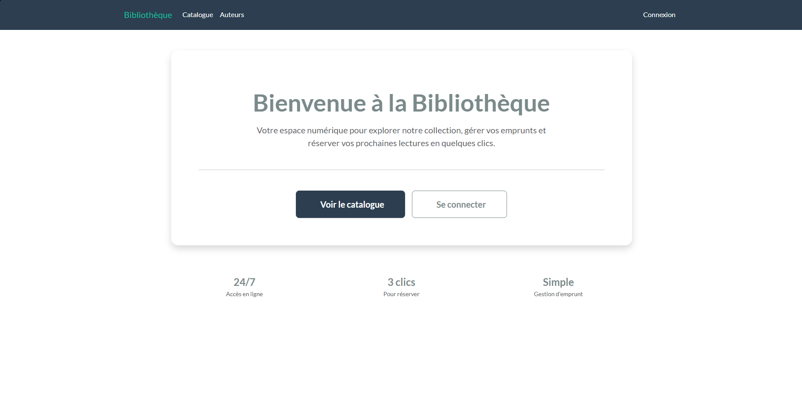
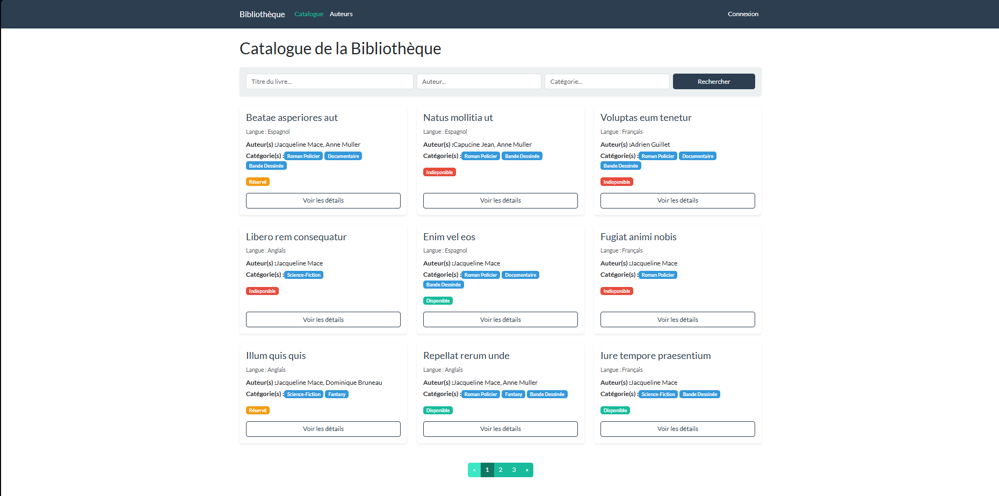

### Test 2
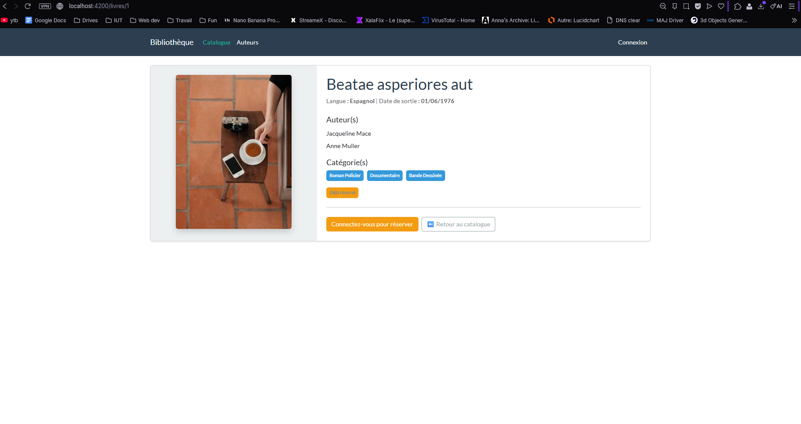

### Test 3
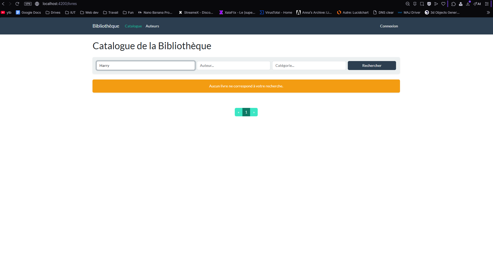

### Test 4
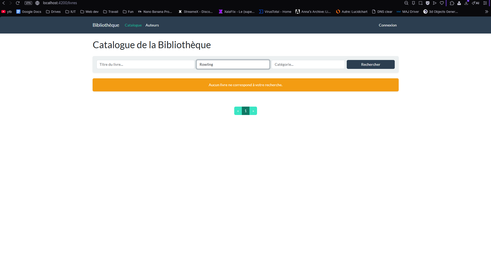

### Test 5
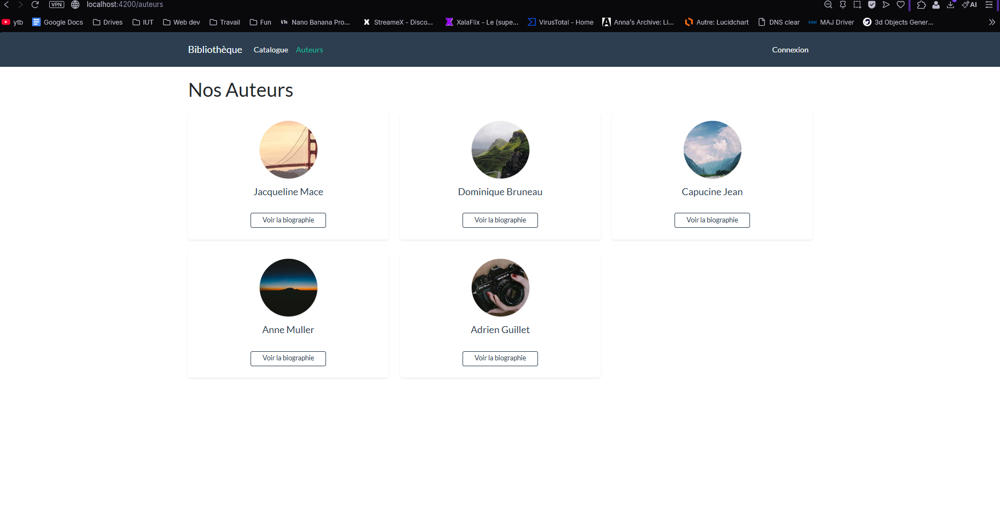

### Test 6
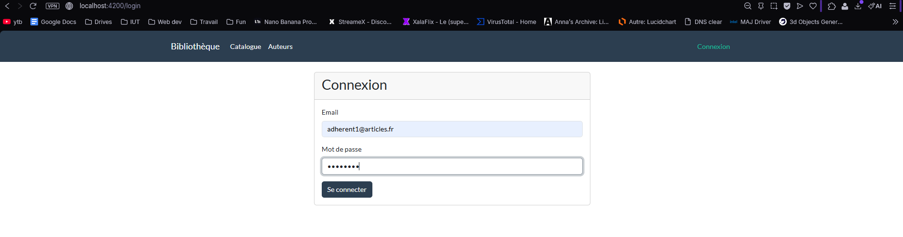

### Test 7
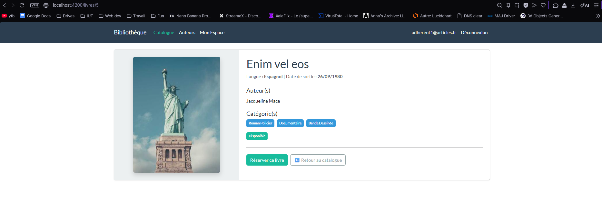

### Test 8 (meme capture que Test 6)

### Test 9 (meme capture que Test 6)

### Test 10
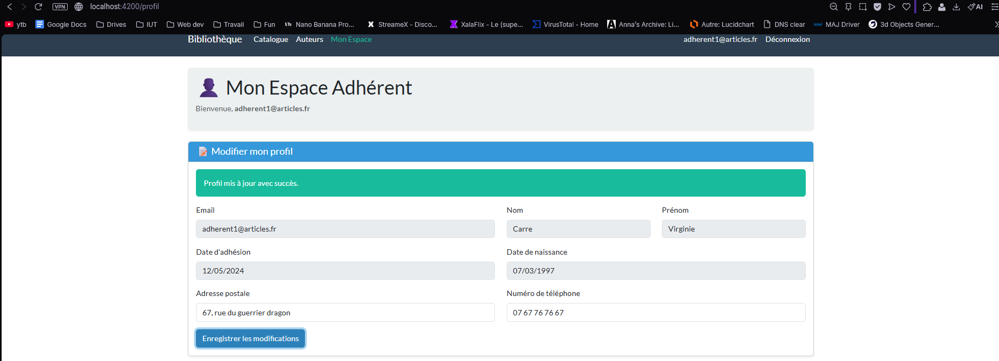

### Test 11
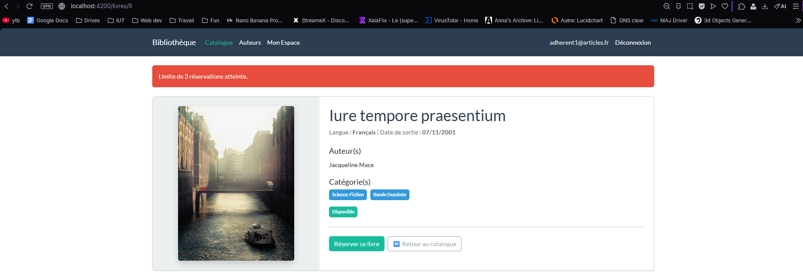

### Test 12
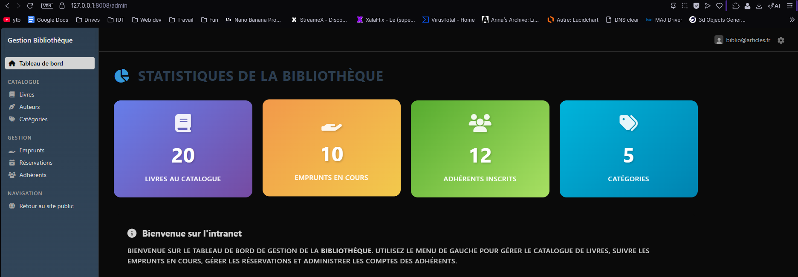

### Test 13
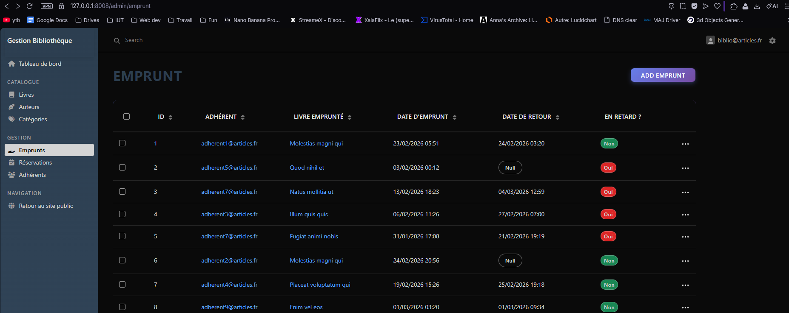

### Test 14

### Test 15 (meme capture que Test 13)

### Test 16
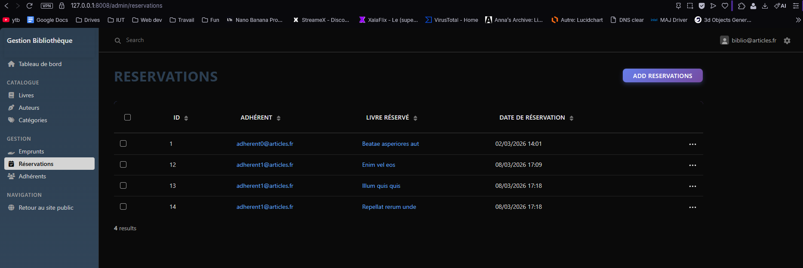

### Test 17
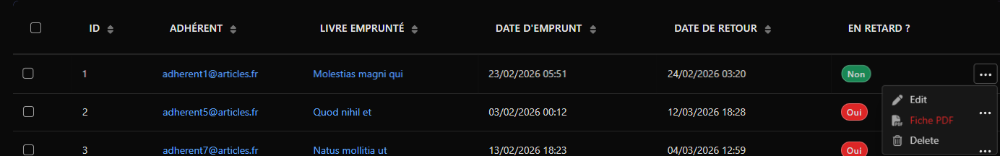

### Test 18
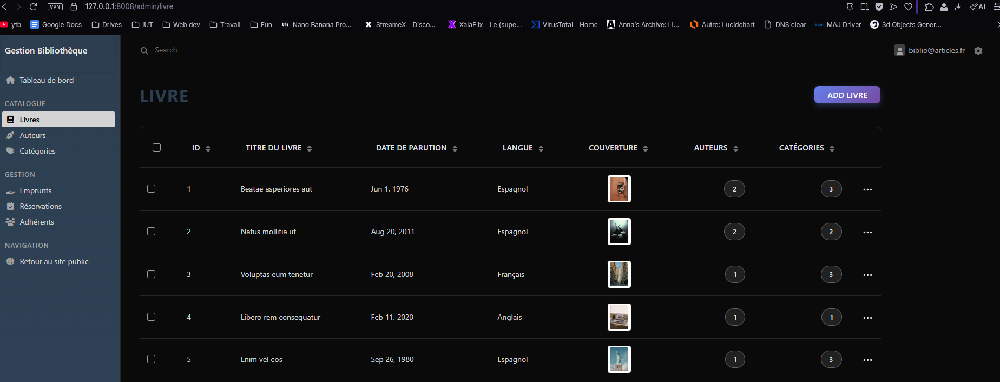

### Test 19
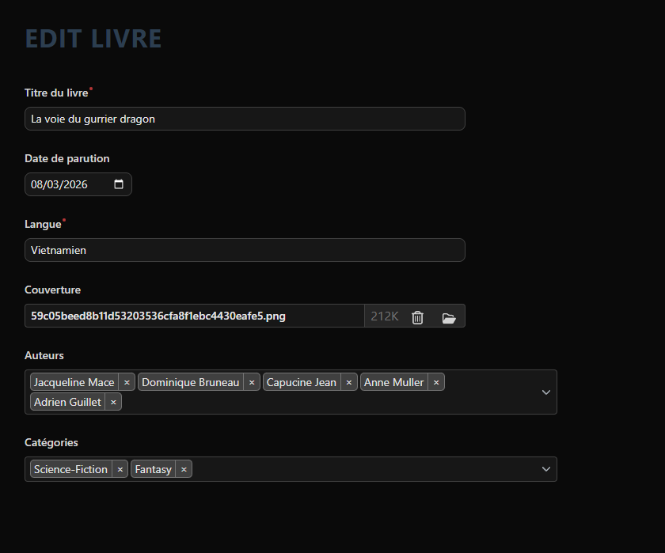

### Test 20

### Test 21
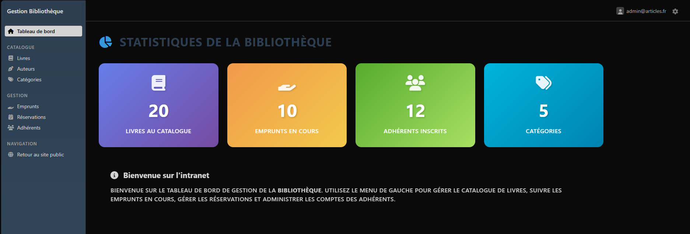

### Test 22
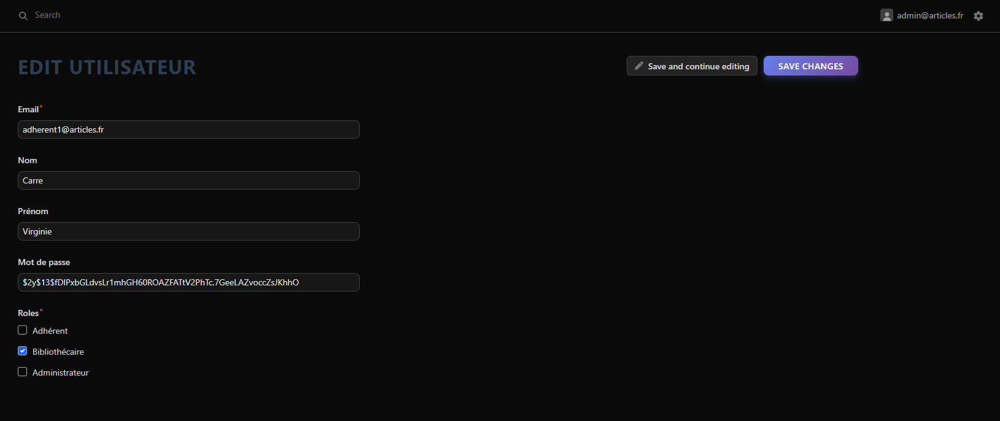

### Test 23

### Test 24

### Test 25

### Test 26

**Fin du Cahier de Recette**
